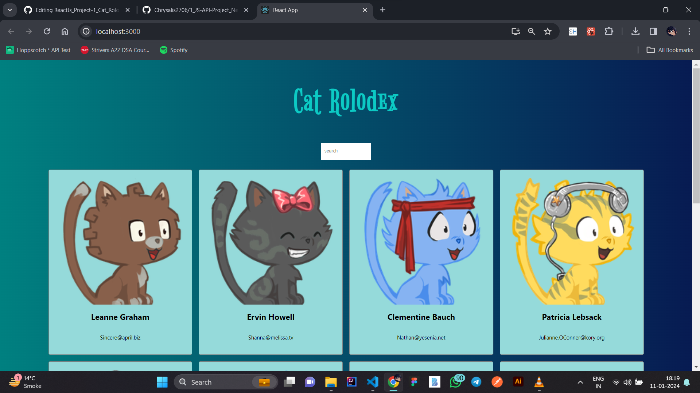

## React JS Project 1 : Cat Rolodex

[JSON Placeholder for fetching names, emails, etc](https://jsonplaceholder.typicode.com/users)
 
[Fetch vector images of cats from here](https://robohash.org/)

### Overview

My initial React JS project, "Cat Rolodex," was a personal endeavor for learning. It featured a sleek interface allowing users to search and explore cat vector images through an API. The project honed my React skills, emphasizing component-based development and integrating external data sources, fostering a foundation for future endeavors.

### Preview

